# Roomle Button

### Introduction
This library is used to enhance furniture product pages. The Roomle Button library creates links for furniture which is available in Roomle. This gives the customers the possibility to experience the furniture on the next level. The furniture can be customized, viewed in augmented reality, positioned into a room or just visualized. Rooms can be visited in virtual reality and this gives the user a great impression how a furniture can look like in a room. The Roomle Button library therefore detects the devices which the user uses to visit the website and provides the links with the best user experience. For example: if the user wants to see a furniture on AR and she/he is on an iOS device the Roomle Button libary provides a deeplink into the Roomle App. If the user is on desktop a explanation is shown how she/he can experience AR.

To provide this functionality there are two modes. `Enhance mode` and the `libary mode`. The first one detects products which are available on Roomle and adds the so called `Roomle Button`. A click on this button opens a pop up lists all the options of the product. The `libary mode` provides an API which can be queried for links. Let's dive into `enhance mode` first.

### Terminology
The Roomle Button Library includes the whole functionality to provide the user the best link to experience Roomle content. Because the name Roomle Button could be missleading we need to clearify some terms in advance. If you use only the API then you use the Roomle Button Library. If you use view elements which are rendered into the DOM there are several different elements available

#### Roomle Button Trigger
When you click on this button all available options for a user according to her/his device are shown. If you use the Roomle Button Library in `enhance mode` a pop up is opened which presents the user the options

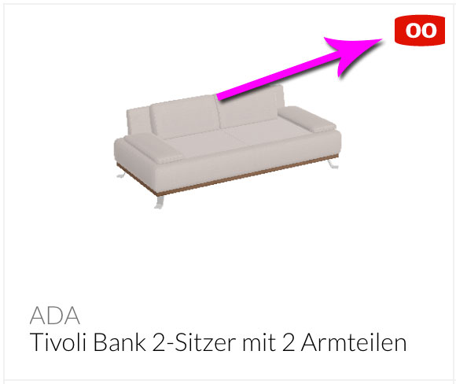

#### Roomle Button Pop Up
This pop up shows all options which are available for the user in a list. There you see the different button types.

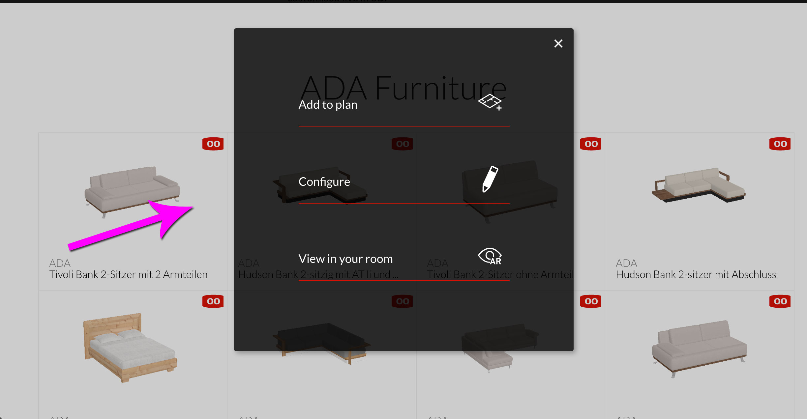

#### Button Types
The following screenshot displays a possible view on the options

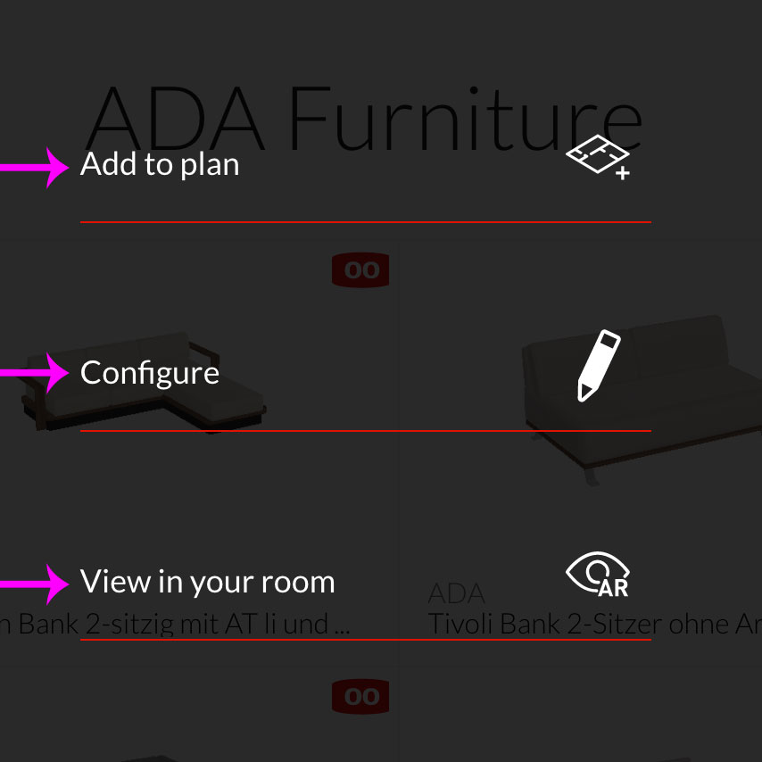

##### Button Types

| Icon | Name | String Id |
|------|------|-----------|
| 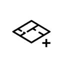 | Add to Plan | add |
| 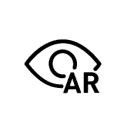 | Augmented Reality | ar |
| 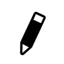 | Configure | configure |
| 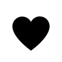 | Mark | mark |
| 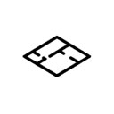 | Start now | start_now |
| 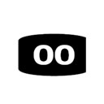 | Trigger | trigger |
| 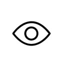 | Visualize | visualize |
|  | Virtual Reality | vr |

#### Highlighted
If an option is not available on the current device of the user a description on how to enable it is shown. This looks like the following:

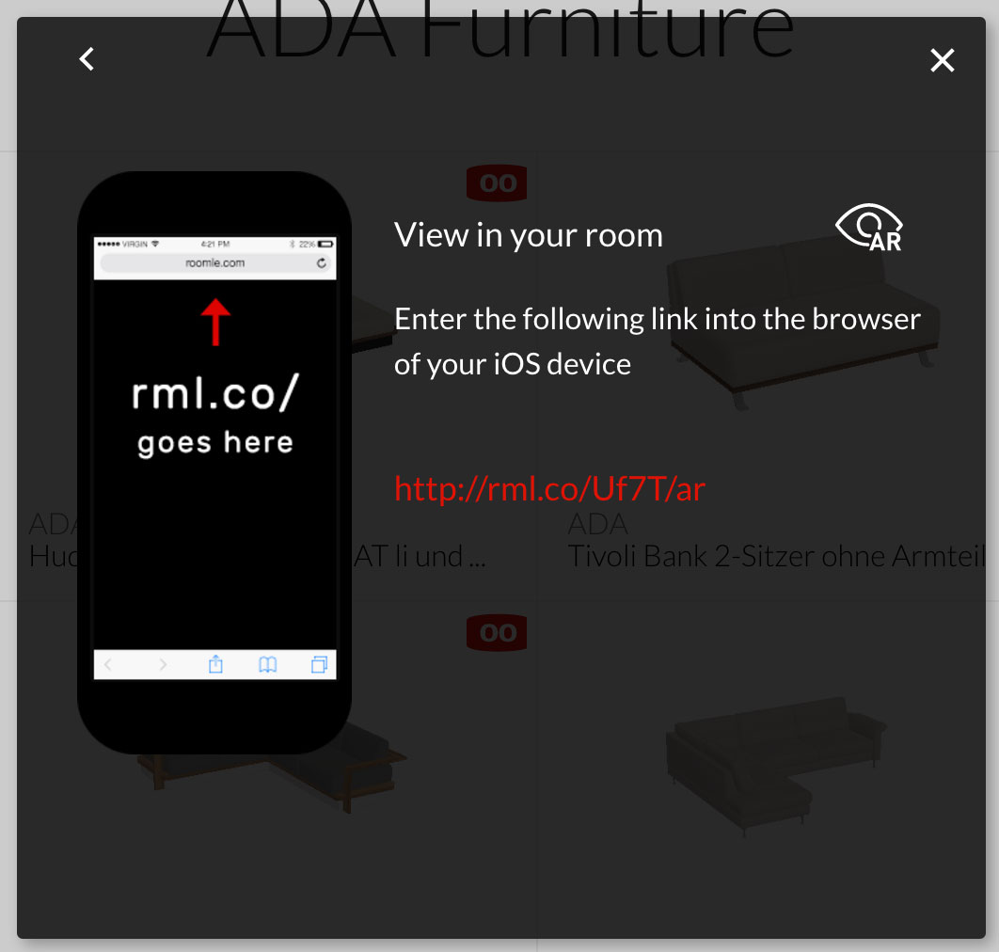

#### Roomle Type
Right now there are the following types of Roomle content supported by the Roomle Button:

* `item`: aka furniture or product
* `configurable-item`: aka configurable or customizeable furniture or product
* `configuration`: a configuration which is created by a Roomle user
* `plan`: a room plan configured in Roomle

All of this types have a Roomle content id. This id is needed to fetch the correct data to create the links.

### How to include the script
To include the Roomle Button script into your page you have two options. You can do this by packeging it with your scripts or by lazy loading the script on demand. We recommend the second option due to several performance considerations. For this option it is important that the js and css file have the same name (except the file extension) and are acessible via the same root directory. The only difference should be the js and css folder. The folder structure should look like the following

```
root  |
      | css |
      |     | roomle-button.min.css
      |
      |  js | roomle-button.min.js
            | es6-promise.min.js
```
The `es6-promise.min.js ` polyfill is only included for old legacy browsers which do not support native Promises (for more details see [can i use](http://caniuse.com/#feat=promises)).

For security reasons a SRI hash is included so you can be sure that the correct script is loaded (this is especially important when lazy loading the scripts). For more details on SRI see the following [MDN page](https://developer.mozilla.org/en-US/docs/Web/Security/Subresource_Integrity)

#### Roomle Button configuration object
To configure the Roomle Button you have to specify a JavaScript object available on the same scope as the Roomle Button. Most of the time this will be the `window` scope (since this is the global scope in the browser).  The name of the object is `RoomleButtonSettings`. For the detailed settings see section: XXX. A possible implementation could be:

```javascript
window.RoomleButtonSettings = {
    // ...
    // All settings
    // ...
}
```


### Enhance mode
As explaind in the introduction section above the `enhance mode` adds the Roomle Button to an existing page. A working example can be seen [on our website](https://www.roomle.com/en/furniture-catalog/vizmotor_0:ikea). After you included the Roomle Button JavaScript you need to adjust the HTML markup of your page slightly. Every product which should be enhanced with the Roomle Button has to contain the following two markup attributes:

* data-rml-id: the roomle id
* data-rml-type: what kind of id it is, the following values are currently possible
    * item
    * configurable-item
    * configuration
    * plan

The type attribute is needed to save XHR requests to the roomle server. Otherwise the Roomle Button library would have to ask the server for every id about it's type. This would delay the enhancment with the Roomle Button by one network request. To remove this delay the Roomle Button Library needs to know the type in advance. An example HTML markup could look like:

```HTML
<div class="container">
    <div class="row">
        <div class="col-xs-3">
            <div class="roomle-item" data-rml-id="moroso:Byobu_BY0T32" data-rml-type="item">
                <!-- ITEM -->
            </div>
        </div>

        <div class="col-xs-3">
            <div class="roomle-item" data-rml-id="usm:TVLowboard" data-rml-type="configurable-item">
                <!-- CONFIGURABLE ITEM -->
            </div>
        </div>

        <div class="col-xs-3">
            <div class="roomle-item" data-rml-id="8a708083560ca6cf01560d7c0c680604" data-rml-type="plan">
                <!-- PLAN -->
            </div>
        </div>
		<div class="col-xs-3">
            <div class="roomle-item" data-rml-id="usm:frame:5E02253410A8C40DCCAA2F48A7682FF8C54B6C1204357299D370DAFC8FFD199C" data-rml-type="configuration">
                <!-- CONFIGURATION -->
            </div>
        </div>
    </div>
</div>
```

### Library mode
If you don't need the automagicall addition of the Roomle Button, there is also the library mode. This means that the Roomle Button Library does not try to find annotated HTML markup. If you use the Roomle Button this way, you have to hook up everything on your own. It is important to notice that `enhance mode` and `library mode` are not exclusive to each other. Of course you can use `enhance mode` and the API of the library.

### API
The Roomle Button Library adds itself to the scope it was loaded. In browser environment this will be most of the time the ```window``` scope. There a variable named ```RoomleButtonInstance``` is created. All the described functions are available on this object.

#### appendButtons
Is used to append the possible links as buttons to a given container. The buttons are created context sensitive which means only buttons which are available to the user on her/his current device. Therefore you have to pass the container, the roomle id and the type as parameters to the function.

* `container`: the container is a query selector as string e.g. `.deeplink--detail`
* `id`: the id is the id how it's saved to the roomle backend
* `type`: can be one of the explained types in `enhanced mode` (see data-rml-type)

#### dispatchClick
Can be used to simulate a click on a button in the Roomle Button logic, therefore the following parameters are needed:

* `e`: the native browser event which triggered this action
* `type`: the type of the roomle-item for available types see data-rml-type
* `id`: is the roomle id
* `buttonType`: which button was clicked. For button types see button types
* `highlight`: boolean flag to set a link to highlighted or not

#### execDeeplink
Is used to execute a roomle button link. This the link which fits best to the users device is executed. For example if a mobile device is used, a link into our App is performed on desktop into the webapp. Some features are not available on every platform (due to missing hardware). For example AR makes not much sense on a desktop device. If a user wants to use a feature not available on the current device a pop up will explain how to enable this feature. Also the user is redirected to the app store if she/he is on mobile and has the app not installed. The parameters are id, type, clickedButton, newWindow, callback.

* `id`: is the roomle id
* `type`: the type of the roomle-item for available types see data-rml-type
* `clickedButton`: for which button should the link be triggered
* `newWindow`: is a boolean flag, when set to true a new window is opened
* `callback`: a function which is triggered when the execution of the link is finished

#### getDomLinkFor
returns a button for the given type. The button is a HTML element with all the needed logic attached to give the best link to the user according to the used device. Also a fallback to store logic is implemented for mobile devices. The following paramters are passed to the function:

* `action`: the link of which button
* `id`: the id of the roomle element
* `type`: the type of the roomle element
* `isHighlighted`: boolean flag to show the link in more advance

#### getLinks
returns all available links for a given type according to the users device. The fallback to store logic has to be built by the developer who is using the Roomle Button. Parameters for this function are:

* `id`: the id of the roomle element
* `type`: the type of the roomle element
* `callbackUrl`: a url to which a possible deeplink into an app should go back after the user is finished using the app, this is optional

#### openCustomPopUp
if you want to use the Roomle Button pop ups to stay in sync with the CI and UX of the Roomle Button and not have different pop ups all over the place you can use this method. The parameters are:

* `e`: the event which triggered the open pop up event. This is the native browser event.
* `content`: the HTML content which should be injected into the pop up.
* `parent`: the HTML element to which the pop up should be attachted. This is an optional parameter

### Settings
Comming soon

### Styleing
As of now there is no defined interface to style the Roomle Button HTML elements. The pop up etc are injected into your HTML so there is the way to overwrite the Roomle styles via CSS but since this is not supported Roomle can not guarantee that these styleings won't break with the next release. All Roomle CSS styles are prefixed with ```rml-``` to prevent possible naming collissions.

